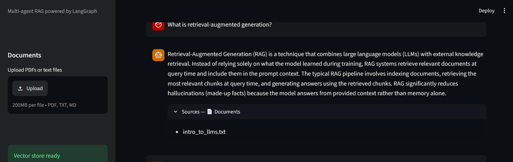
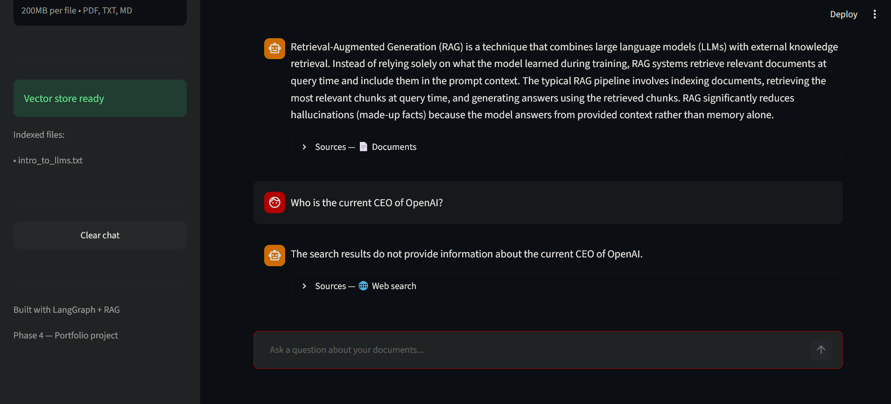
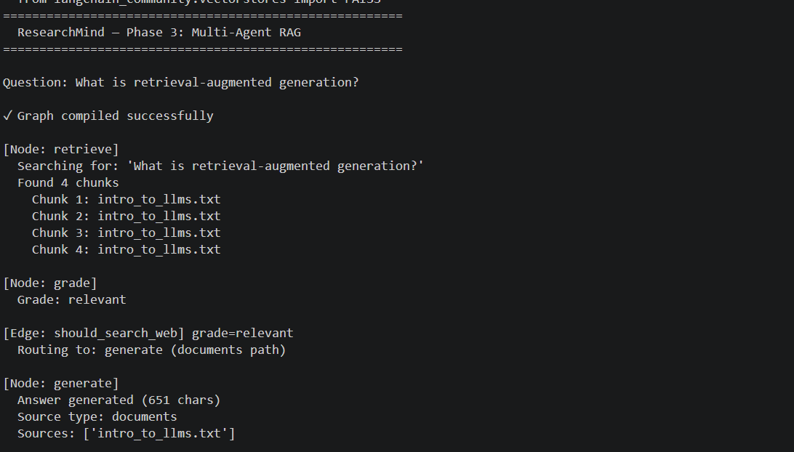
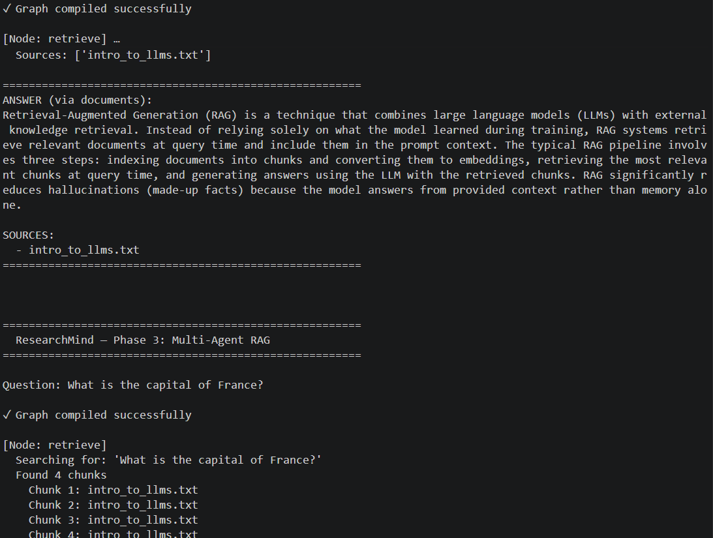
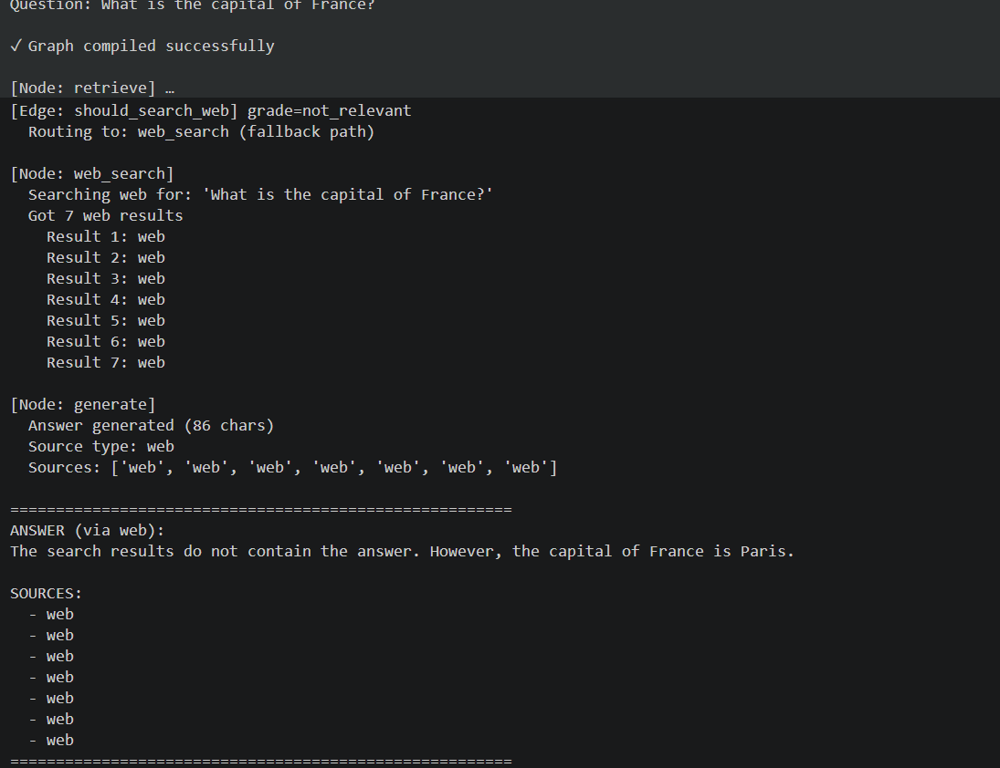

# ResearchMind 🔍

A multi-agent RAG system built with LangGraph. Upload your documents, ask questions, get cited answers — with automatic web search fallback when your docs don't have the answer.

🚀 **[Live Demo](https://researchmindd.streamlit.app/)** | 💻 **[GitHub](https://github.com/KasraRasi/researchmind)**







---

## Architecture

```
User question
      ↓
  retrieve       — semantic search over uploaded documents (FAISS)
      ↓
   grade         — LLM decides if retrieved chunks are actually relevant
      ↓
 ┌────┴────┐
 │         │
generate  web_search    — Tavily web search (fallback when docs don't have the answer)
 │         │
 └────┬────┘
      ↓
   generate      — builds final answer from whichever context is available
      ↓
Answer + cited sources
```

Every node has a single responsibility. The `generate` node sits at the end of both paths and handles document chunks and web results uniformly — no duplicated generation logic.

The grader node is what makes this reliable. Without it, the system would confidently answer from irrelevant chunks. The grader acts as a quality gate before any answer is generated.

---

## Tech Stack

| Layer | Technology | Why |
|---|---|---|
| Agent orchestration | LangGraph | Stateful graph with conditional routing |
| LLM + embeddings | OpenAI (gpt-4o-mini + text-embedding-3-small) | Fast, cheap, good quality |
| Vector store | FAISS | Lightweight, no server, works locally |
| Document loading | LangChain loaders | Handles PDF, txt, md out of the box |
| Web search | Tavily | Built for LLMs, returns clean structured text |
| UI | Streamlit | Rapid chat interface with session state |

---

## Features

- Upload PDF, `.txt`, or `.md` files via the sidebar
- Ask questions in natural language
- Answers cite the exact source file used
- Automatically falls back to web search when documents don't contain the answer
- Badge shows whether the answer came from `📄 Documents` or `🌐 Web search`
- Chat history persists across questions in the session

---

## Project Structure

```
researchmind/
├── data/
│   ├── sample_docs/     ← drop your documents here
│   └── faiss_db/        ← auto-created after first ingestion
├── src/
│   ├── ingest.py        ← document ingestion pipeline
│   ├── graph.py         ← LangGraph multi-agent graph
│   └── app.py           ← Streamlit chat UI
├── .env.example
├── .gitignore
├── requirements.txt
└── README.md
```

---

## Setup

### 1. Clone and install

```bash
git clone https://github.com/KasraRasi/researchmind
cd researchmind
python -m venv venv
source venv/bin/activate   # Windows: venv\Scripts\activate
pip install -r requirements.txt
```

### 2. Set API keys

```bash
cp .env.example .env
```

Edit `.env`:
```
OPENAI_API_KEY=sk-...
TAVILY_API_KEY=tvly-...
```

Get a free Tavily key at [tavily.com](https://tavily.com) — no credit card needed.

### 3. Add documents and index them

Drop any `.pdf`, `.txt`, or `.md` files into `data/sample_docs/`, then:

```bash
python src/ingest.py
```

Or use the upload UI in the app directly.

### 4. Run the app

```bash
streamlit run src/app.py
```

Opens at `http://localhost:8501`.

---

## How It Works

When you ask a question, the graph runs through four nodes in order. The retrieve node embeds your question and finds the four most semantically similar chunks in the FAISS index. The grade node asks the LLM whether those chunks actually contain enough information to answer — if yes, generate is called directly. If no, web_search fetches live results from Tavily first, then generate builds the answer from those results instead. Either way, the same generate node handles the final step, keeping the logic clean and non-duplicated.

---

## What I Learned

- **Retrieval quality is the foundation of RAG.** The LLM can only be as good as the chunks it receives. Chunk size, overlap, and the choice of embeddings model all directly affect answer quality — something you only understand by building and testing it yourself.

- **Grading before generating prevents confident wrong answers.** Without the grader node, the system would answer from irrelevant chunks and sound certain. The self-reflection pattern — having the LLM evaluate its own inputs — is one of the most important patterns in production agentic systems.

- **Single responsibility makes agents debuggable.** Separating web_search (fetch only) from generate (answer only) meant I could test and fix each step independently. When web results were returning the wrong format, I fixed one function without touching anything else.


## License

MIT
